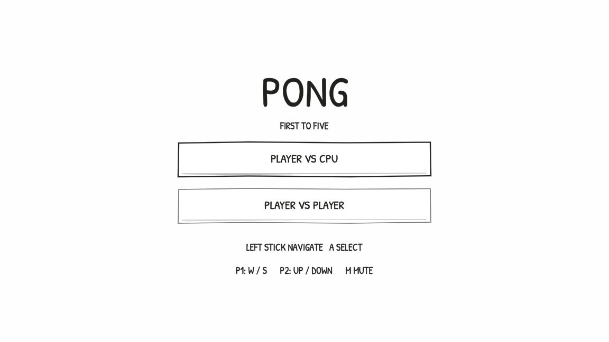
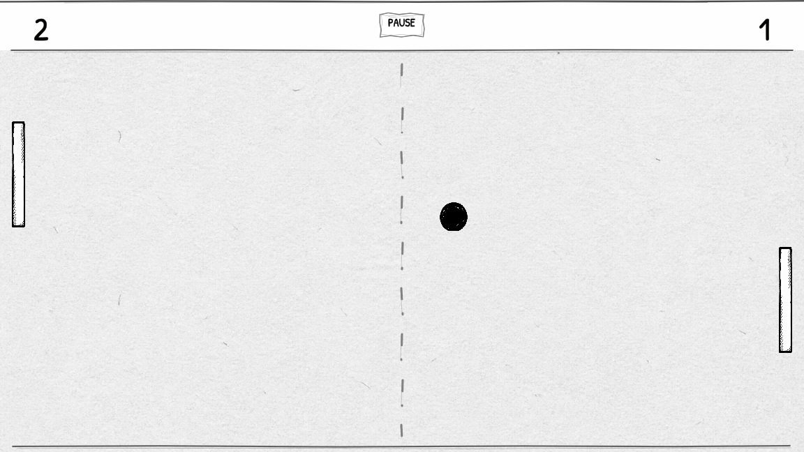

<div align="center">


# PONG

**A paper-and-ink arcade game with aimed serves, lively rallies, local play, and private online rooms.**

[](https://gr33nops.github.io/pong/)
[](https://github.com/Gr33nOps/pong/releases/latest)
[](https://godotengine.org/)

[Play now](https://gr33nops.github.io/pong/) · [Download](https://github.com/Gr33nOps/pong/releases/latest) · [Report a problem](https://github.com/Gr33nOps/pong/issues)

</div>

## The game

PONG keeps the immediate rules of the original and gives every screen a tactile sketchbook feel. The ball waits beside the serving paddle, serves can be aimed, paddle movement adds english, and long rallies grow faster and more dangerous. First to five wins.





## Play your way

| Mode | Players | How it works |
|---|---:|---|
| Player vs CPU | 1 | Three difficulty levels with configurable sound and touch/controller support. |
| Player vs Player | 2 local | Share a keyboard, controllers, or opposite sides of a touch screen. |
| Online | 2 remote | Create a private six-character room, copy the code, and send it to your opponent. |

The hosted online server may need a short wake-up after being idle. The lobby waits through that startup and shows clear connection, room, countdown, serve, disconnect, and rematch states.

## What makes it different

- Hand-drawn panels, controls, court markings, paddles, ball, and loading experience
- Aimed serves from the paddle instead of automatic center-court launches
- Paddle english, speed ramping, sharper edge returns, and shrinking paddles during long rallies
- Server-authoritative online matches with private rooms and smooth 30 Hz snapshots
- Keyboard, controller, mouse, and touch input with context-aware instructions
- Rally-sensitive sound, ink impact effects, motion trail, and screen shake
- First to five with loser-serves-next rules

## Controls

| Action | Keyboard | Controller | Touch / mouse |
|---|---|---|---|
| Move | P1: W/S · P2: ↑/↓ | Left stick or D-pad | Drag your side of the court |
| Aim serve | Move the serving paddle | Left stick | Drag before serving |
| Serve / select | Space | A | Tap |
| Pause / back | Esc | Start / Back | Pause button |
| Mute | M | — | Pause menu |

In Online mode, either W/S or ↑/↓ controls your paddle.

## Download

The [latest release](https://github.com/Gr33nOps/pong/releases/latest) includes:

- Windows x64 archive
- Browser-ready Web archive for hosts such as itch.io
- Android arm64 sideload APK
- SHA-256 checksums for every download

Windows builds are currently unsigned, so SmartScreen may show an unknown-publisher warning. The Android download is debug-signed for direct testing and sideloading.

## Run from source

Requires Godot 4.7.1.

1. Clone the repository.
2. Open the directory containing `project.godot` in Godot.
3. Press **F5**.

Run the deterministic client checks:

```bash
godot --headless --path . --script tests/smoke.gd
godot --headless --path . --script tests/menu_layout_smoke.gd
godot --headless --path . --script tests/online_lobby_smoke.gd
```

## Build

Export presets are committed for Windows, Web, and Android:

```bash
godot --headless --path . --export-release "Windows Desktop" ../pong-build/pong.exe
godot --headless --path . --export-release "Web" ../pong-build/web/index.html
godot --headless --path . --export-release "Android" ../pong-build/android/Pong.apk
```

Every push to `main` validates gameplay, UI layout, room flow, the authoritative server, and a real two-client online lifecycle before deploying GitHub Pages. A `v*` tag builds and publishes the downloadable release artifacts.

## Project map

- `main.gd`, `game_state.gd` — match orchestration, scoring, serve, and online state
- `ball.gd`, `paddle.gd`, `ai.gd` — local gameplay simulation
- `serve.gd`, `pause.gd`, `game_over.gd` — paper-and-ink UI flows
- `network_manager.gd` — WebSocket client, rooms, input, heartbeats, and snapshots
- `server/` — authoritative headless match server
- `tests/` — deterministic UI, gameplay, room, socket, and lifecycle checks

Contributions are welcome. See [CONTRIBUTING.md](CONTRIBUTING.md) and [SECURITY.md](SECURITY.md).
