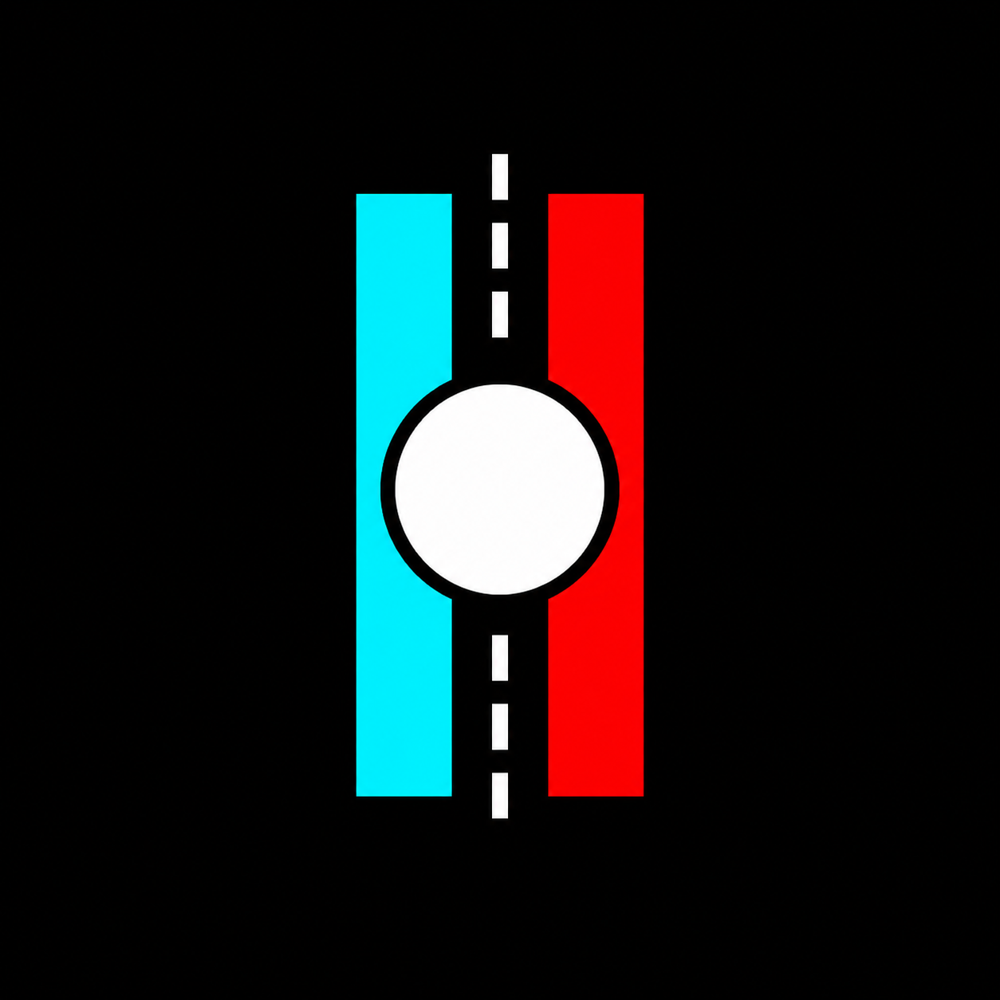

<p align="center">
  
</p>

# PONG

A classic Pong remake built with **Godot 4.7** — aimed serves, rally heat, and a glowing motion trail.

## Play

- **Web (browser):** <https://gr33nops.github.io/pong/> — built and deployed automatically by GitHub Actions on every push to `main`.
- **Windows:** grab `pong-windows.zip` from the [Releases](https://github.com/Gr33nOps/pong/releases) page, unzip, and run `pong.exe`.
- **Android:** grab `pong-android.apk` from the [Releases](https://github.com/Gr33nOps/pong/releases) page and install it (enable "Install unknown apps" for your browser/file manager first).

## Features

- Player vs AI and Player vs Player (pick on the start screen)
- Keyboard (W/S for P1, arrows for P2) plus auto-detecting gamepads
- Loser serves: ball sits on the paddle; aim with movement, then Space / A to launch
- Center hits are faster and flatter; edge hits are sharper and a bit slower
- Paddle english, rally speed ramp, and paddles that shrink after a long volley
- Live **RALLY** counter, speed-scaled SFX pitch and screen shake
- Pause menu (ESC / START) with volume, AI difficulty, and colorblind colors
- First to 5 wins

## Controls

| Action    | P1        | P2           | Gamepad           |
|-----------|-----------|--------------|-------------------|
| Move      | W / S     | ↑ / ↓        | Left stick, D-pad |
| Confirm   | Space / A | (pad A)      | A / START         |
| Mode pick | 1 / 2     | (pad d-pad)  | D-pad + A         |
| Pause     | ESC       | START / BACK | START / BACK      |

Aim the serve by moving the paddle before you launch. In vs AI, the computer auto-serves after a short delay.

## Running from source

1. Open `pong/` (the project root, where `project.godot` lives) in the Godot 4.7 editor.
2. Press **F5**.

## Building

All presets are in `export_presets.cfg`. From the project root:

```bash
godot --headless --path . --export-release "Windows Desktop"
godot --headless --path . --export-release "Web"
godot --headless --path . --export-debug "Android"
```

Pushing a `v*` tag (e.g. `v1.0.0`) triggers [`release.yml`](.github/workflows/release.yml), which builds all three and publishes them to a [GitHub Release](https://github.com/Gr33nOps/pong/releases).

## Project layout

- `constants.gd` — shared gameplay numbers
- `game_state.gd` — scores, serve/pause/game-over flow, mode selection
- `main.gd` — scoring, aimed serve placement, rally UI
- `ball.gd`, `paddle.gd`, `ai.gd`, `trail.gd` — gameplay
- `players.gd` — gamepad auto-assignment + input latches
- `serve.gd`, `pause.gd`, `game_over.gd` — UI overlays
- `sfx.gd`, `screen_shake.gd`, `particle_effects.gd` — juice
